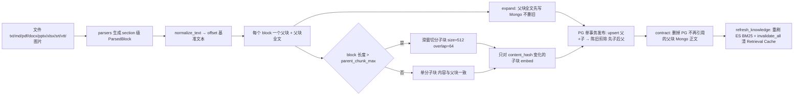
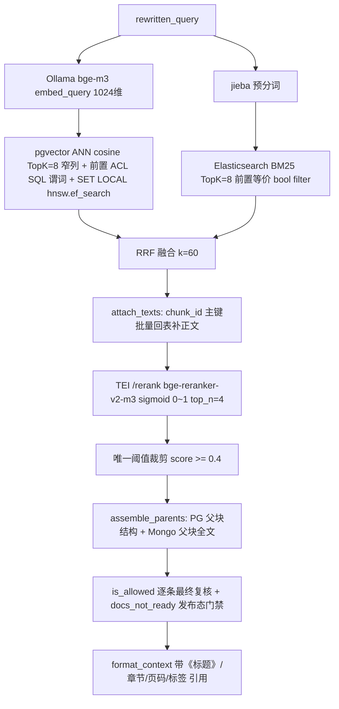

# RAG 企业知识底座：多模态入库 + 混合检索 + 权限裁剪

<cite>
**参考文件**
- [app/rag/retriever.py](file://app/rag/retriever.py)
- [app/rag/ingest.py](file://app/rag/ingest.py)
- [app/rag/vectorstore.py](file://app/rag/vectorstore.py)
- [app/rag/bm25.py](file://app/rag/bm25.py)
- [app/rag/reranker.py](file://app/rag/reranker.py)
- [app/rag/embeddings.py](file://app/rag/embeddings.py)
- [app/bodies/store.py](file://app/bodies/store.py)
- [app/docs/parsers.py](file://app/docs/parsers.py)
- [app/docs/service.py](file://app/docs/service.py)
- [app/config.py](file://app/config.py)
</cite>

## 目录

1. [定位与边界](#定位与边界)
2. [入库链路](#入库链路)
3. [检索链路](#检索链路)
4. [阈值与拒答策略](#阈值与拒答策略)
5. [ACL 与索引动态更新](#acl-与索引动态更新)
6. [默认参数](#默认参数)
7. [工程坑位清单](#工程坑位清单)

## 定位与边界

RAG 底座是 Assistant `knowledge_qa` 路由的实现体，对上只暴露三个方法：`HybridRetriever.retrieve(query, principal)`、`assemble_parents(children)` 与 `format_context(chunks, meta_map)`。它同时承载三条链路：

- **语义链路**：多模态解析 → 父子切分 → bge-m3 向量化 → pgvector 稠密检索 + Elasticsearch BM25 疏通道的 RRF 融合 → 主键回表补正文 → rerank 裁剪 → 父块组装。
- **授权链路**：文档权限以标量列冗余在每个知识块上，两条检索通道各有一份语义等价的过滤器，进入 Context Builder 前再复核一次（外加发布态门禁）。
- **运营链路**：Web 两阶段上传（解析预览 → 确认入库）、LLM 标签推荐、权限热更新、ES 派生索引重刷与缓存失效。

存储是**三层分工**，不是单一 PostgreSQL：

- **PostgreSQL + pgvector**：事实来源。`documents`（元数据 + ACL 真相）、`doc_parents`（父块结构与定位，**不存正文**）、`doc_chunks`（子块 + `chunk_text` + 向量 + ACL 标量列）。
- **MongoDB**：正文外置层。整篇 `raw_text/normalized_text/structure`（`doc_bodies`，超 16MB 溢出到 `doc_body_parts`）与父块全文（`parent_texts`）；只按 `_id/parent_id` 精确批量取，无全文查询、不承载权限语义。
- **Elasticsearch**：可从 PG 全量重建的 BM25 派生倒排，只存 `content_tokens`（不存正文，避免第三副本）。

**Sources** · [app/rag/retriever.py:63-210](file://app/rag/retriever.py#L63-L210) · [app/bodies/store.py:1-9](file://app/bodies/store.py#L1-L9) · [app/config.py:171-209](file://app/config.py#L171-L209)

## 入库链路

- **多模态解析**（`app/docs/parsers.py`）：md 按标题栈拆块并记录 `章节路径`；pdf 按真实页拆块（无文本层的扫描页取内嵌图片走 MinerU OCR 兜底）；docx 按 Heading/标题样式（中英文都支持）；pptx 按幻灯片；xlsx 按工作表；srt/vtt/`*.transcript.txt` 合并成带 `[开始 -> 结束]` 时间轴的 `video_transcript` 块；图片 `jpg/jpeg/png/webp/bmp` 经 MinerU `/file_parse` 转 markdown。MinerU 不可用是**报错**（上传接口转 502），不静默丢内容。
- **文档身份**：`doc_id = sha1(文件名|小写扩展名)[:16]`，与路径无关，重传同名同类型文件即覆盖（单版本语义，无版本列）。
- **父子分块**：每个 section 块 = 一个父块；父块正文只进 Mongo，PG 父表只留结构定位（`start_offset/end_offset` 以 `normalized_text` 为基准，随 `normalizer_version` 同升降）。检索只命中子块；子块留 PG `chunk_text` 并携带 `content_hash` 供增量 embed。
- **expand-then-contract 顺序不得违背**：正文先落 Mongo 再发 PG（PG 可见的行一定取得到文本），发布完才收缩旧正文。取代旧"先 `delete_by_doc` 再 upsert"两个独立事务造成的检索空窗。
- **权限戳记**：`visibility / owner_id / dept_id / allowed_roles` 随每个块写入父子两表，`allowed_roles` 以 `,hr,admin,` 逗号包裹形式存储。

**Sources** · [app/rag/ingest.py:1-16](file://app/rag/ingest.py#L1-L16) · [app/rag/ingest.py:117-251](file://app/rag/ingest.py#L117-L251) · [app/docs/parsers.py:305-354](file://app/docs/parsers.py#L305-L354)

## 检索链路

- **稠密通道**（`ChunkStore.search`）：`DocChunkRow.embedding.cosine_distance(...)`（即 `embedding <=> query`）升序 `LIMIT k`，TopK 只取 `NARROW_COLUMNS`（**不含 `chunk_text` / `embedding`**），ACL 谓词作用在排序截断之前；表本身就分开了父子，已无 `is_parent` 过滤条件。会话内 `SET LOCAL hnsw.ef_search = max(100, top_k*8)` 抬高候选量以补偿标量过滤带来的召回损失，随后显式 `rollback` 结束隐式事务，避免污染连接池。
- **主键回表**：`attach_texts` 必须发生在 rerank **之前**（关键不变量）——否则 cross-encoder 拿到空正文，会被阈值整批裁空，表现为"静默未找到相关文档"。
- **稀疏通道**（`bm25.py`）：中文在索引侧与查询侧都用 jieba 预分词并以空格拼接，ES 侧只需自定义 `whitespace + lowercase` 分析器即可复现同一词元流，因此**无需 IK 分词插件**；ES 异常时降级为空通道由稠密通道兜底，绝不阻断对话。
- **重排**（`reranker.py`）：一次性批量送 TEI 容器（进程级共享 `AsyncClient`，总超时 3s / 建连 0.5s），打分文本 = `标题 + 正文`按 `rerank_max_chars` 截断；单请求硬截到 `MAX_CANDIDATES=32`（对齐 TEI 默认 `--max-client-batch-size`），溢出候选保持 RRF 相对序附在尾部、不参与打分。
- **父块组装**：命中的子块按 `parent_id` 去重（保留最高分子块的位置），一次 PG 窄列取结构 + 一次 Mongo `$in` 取正文；Mongo 不可用/缺键时退回该父块最高分子块的 `chunk_text`（答案变碎但不拒答，记 warning）。

**Sources** · [app/rag/vectorstore.py:168-228](file://app/rag/vectorstore.py#L168-L228) · [app/rag/retriever.py:84-187](file://app/rag/retriever.py#L84-L187) · [app/rag/reranker.py:77-128](file://app/rag/reranker.py#L77-L128) · [app/rag/bm25.py:191-243](file://app/rag/bm25.py#L191-L243)

## 阈值与拒答策略

全链路**只有一个**相关性阈值 `retrieval_score_threshold = 0.4`，且只作用于 rerank 之后：

- 检索通道与 RRF 只负责召回，不设任何分数裁剪——余弦距离、BM25 分、RRF 分三个尺度不可比，在它们身上设阈值必然失准。
- rerank 分低于阈值的块视为噪声剔除；剔除后为空即"未检索到相关文档"这一**事实**，上抛给编排图的 judge 节点。
- judge 判定（`graph._judge`，条件边与并行分支共用）：有块 → 生成；无块且重试预算未用尽 → `kb_requery` 换改写策略重检一次；重检仍无或命中被 ACL 全量剔除 → 固定话术拒答且 `docs_meta` 返回空列表，不调用 LLM。拒答文案对"越权"与"库里没有"刻意不加区分，避免泄漏文档存在性。
- rerank 被禁用或失败时降级为 RRF 顺序（`score_mode="rrf"`），不做阈值裁剪，避免尺度不匹配把候选全丢；`score_mode` 与实际阈值一并写审计。

**Sources** · [app/config.py:146-166](file://app/config.py#L146-L166) · [app/rag/retriever.py:105-145](file://app/rag/retriever.py#L105-L145) · [app/assistant/graph.py:679-708](file://app/assistant/graph.py#L679-L708)

## ACL 与索引动态更新

- **三份实现、一套语义**：`build_sql_filter`/`_acl_predicate`（pgvector SQL 谓词）、`_acl_filter`（ES bool filter）、`is_allowed`（Python 逐条判定）必须逐条对应，任何一处改动都要同步其余两处；`allowed_roles` 的角色值在 LIKE 匹配前需转义 `%`、`_`、`\`，否则含通配符的角色会放大匹配范围。未知 `visibility` 一律 default-deny，admin 角色全量可见。
- **权限热更新**：`PUT /api/docs/{doc_key}/acl` 先更新 `documents`（事实来源），再 `update_acl_by_doc` 对 `doc_chunks` + `doc_parents` 的四个标量列做**同事务两条 UPDATE**（向量与 HNSW 索引不受影响），最后重刷 ES。若子块表匹配 0 行会显式返回 `warning` 提示重新入库，而不是静默"成功"。
- **入库两阶段 + 发布态门禁**：`POST /api/docs/upload` 只落盘 + 解析 + 重名探测 + LLM 标签推荐（优先复用已有标签）；`POST /api/docs/ingest` 才切分向量化，顺序为 元数据先行（`status=ingesting`）→ Mongo 正文 → 父子块发布 → 转 `ready`（失败标 `failed`）。检索出口用 `docs_not_ready` 一次性批量判定，`status != ready` 或没有元数据行的 doc 视同无权，防"正在入库的半篇文档"被答出去。
- **派生索引重刷**：网关首次取用检索器时 `rebuild_bm25()`（双检锁，只跑一次），以及每次入库/权限变更/删除后由 `refresh_knowledge()` 触发，同处调用 `invalidate_all()` 清 Retrieval Cache。语料源是 PG `doc_chunks` 的 keyset 流式分页，不依赖 Mongo、不一次性加载全表。

**Sources** · [app/rag/vectorstore.py:71-101](file://app/rag/vectorstore.py#L71-L101) · [app/rag/bm25.py:43-85](file://app/rag/bm25.py#L43-L85) · [app/security/acl.py:65-85](file://app/security/acl.py#L65-L85) · [app/docs/service.py:162-366](file://app/docs/service.py#L162-L366)

## 默认参数

| 参数                                                           | 默认值                                             | 位置                      |
| -------------------------------------------------------------- | -------------------------------------------------- | ------------------------- |
| `embedding_model` / `embedding_dim`                            | `bge-m3` / 1024                                    | `app/config.py`           |
| `rag_top_k` / `rerank_top_n`                                   | 8 / 4                                              | `app/config.py`           |
| `retrieval_score_threshold`                                    | 0.4                                                | `app/config.py`           |
| `retrieval_max_retries`                                        | 1                                                  | `app/config.py`           |
| `rerank_enabled` / `rerank_timeout` / `rerank_connect_timeout` | true / 3.0s / 0.5s                                 | `app/config.py`           |
| `rerank_max_chars`                                             | 1024                                               | `app/config.py`           |
| `tei_rerank_url`（宿主轨 / 容器轨）                            | `http://localhost:8080` / `http://tei-rerank:8080` | `app/config.py` + compose |
| `MAX_CANDIDATES`（单批打分上限）                               | 32                                                 | `app/rag/reranker.py`     |
| `parent_chunk_max`                                             | 1200                                               | `app/config.py`           |
| `CHUNK_SIZE` / `CHUNK_OVERLAP` / `CHUNK_MAX_CHARS`             | 512 / 64 / 20000                                   | `app/rag/ingest.py`       |
| `EMBED_BATCH_SIZE`                                             | 64                                                 | `app/rag/embeddings.py`   |
| `upsert_batch_size` / `mongo_batch_page_size`                  | 500 / 500                                          | `app/config.py`           |
| `normalizer_version`                                           | `n1`                                               | `app/config.py`           |
| `mongo_enabled` / `mongo_body_max_bytes`                       | true / 15MB                                        | `app/config.py`           |
| HNSW 索引                                                      | `m=16, ef_construction=64`, `vector_cosine_ops`    | `app/db/models.py`        |
| `es_index`                                                     | `kb_chunks`                                        | `app/config.py`           |

**Sources** · [app/config.py:85-229](file://app/config.py#L85-L229) · [app/rag/ingest.py:36-40](file://app/rag/ingest.py#L36-L40) · [app/rag/reranker.py:24-26](file://app/rag/reranker.py#L24-L26) · [app/db/models.py:365-412](file://app/db/models.py#L365-L412)

## 工程坑位清单

1. **rerank 已从 Ollama 迁到 TEI**：历史实现是拿 Ollama `/api/embed` 的向量做 cosine 近似 cross-encoder（该 GGUF 在 Windows llama.cpp 上调用即崩）。现在是 TEI 容器的真序列分类头，输出 sigmoid 后 0~1；`0.4` 阈值是按这个标度定的，换打分口径必须复核阈值。
2. **正文必须在 rerank 之前就位**：窄列 ANN 出来的 DTO `content` 是空的，`attach_texts` 若排在 rerank 之后，rerank 会对空串打分 → 被阈值裁空 → 表现为"未找到相关文档"的静默故障。
3. **Ollama 大批量 embedding 会崩**：`/api/embed` 的 `input` 数组过大时会在内部 tokenize 阶段失败（实测 406 条必失败、按 64 条分片全通过），故 `EMBED_BATCH_SIZE = 64`。
4. **`search()` 末尾的 `rollback()` 只为结束 `SET LOCAL` 的隐式事务**：DTO 在该 session 关闭前已由 `_chunks_from_narrow` 转好，rollback 后再取 ORM 属性会 `DetachedInstanceError`（历史上记忆召回就因此静默变空）。
5. **换 embedding 模型必须同步 `EMBEDDING_DIM` 并全量重建**向量表，否则维度不匹配。
6. **`create_all` 建 HNSW 索引是非 CONCURRENT 的**（需独占事务），语料上量后应先建表再手工 `CREATE INDEX CONCURRENTLY`。
7. **改 `normalize_text()` 必须同步递增 `NORMALIZER_VERSION`**：offset 基准是 `normalized_text`，规则一改全库旧 offset 集体失效（见 `CONFIG_RULES.md` 第 4 条）。
8. **Mongo 关闭只降级读路径**：已有检索的父块上下文退回子块文本（不阻断对话），但入库写正文会直接报错——不要因为"已统一 PostgreSQL"就判定 Mongo 已下线。
9. **ES 与 pgvector 的 ACL 语义漂移是安全事故**：两通道过滤器与 `is_allowed` 三份实现必须一起改，并用同一批用例校验。
10. **超长父块不再静默截断**：单块正文超 `CHUNK_MAX_CHARS` 会记 error 并随 `warnings` 带出，而不是默默丢字。
