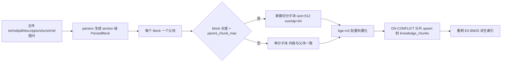
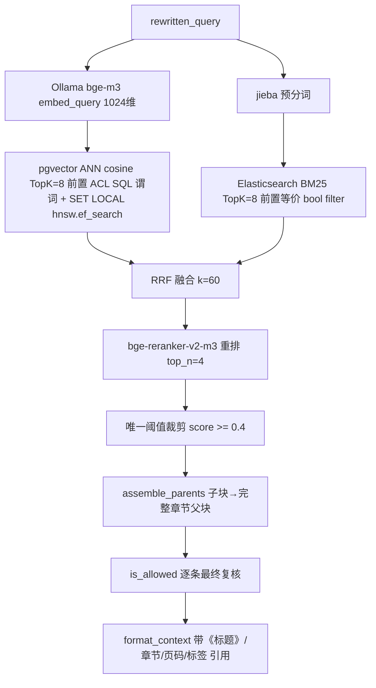

# RAG 企业知识底座：多模态入库 + 混合检索 + 权限裁剪

<cite>
**参考文件**
- [app/rag/retriever.py](file://app/rag/retriever.py)
- [app/rag/ingest.py](file://app/rag/ingest.py)
- [app/rag/vectorstore.py](file://app/rag/vectorstore.py)
- [app/rag/bm25.py](file://app/rag/bm25.py)
- [app/rag/reranker.py](file://app/rag/reranker.py)
- [app/rag/embeddings.py](file://app/rag/embeddings.py)
- [app/docs/parsers.py](file://app/docs/parsers.py)
- [app/docs/service.py](file://app/docs/service.py)
- [app/config.py](file://app/config.py)
</cite>

## 目录
1. [定位与边界](#定位与边界)
2. [入库链路](#入库链路)
3. [检索链路](#检索链路)
4. [阈值与拒答策略](#阈值与拒答策略)
5. [ACL 与索引动态更新](#acl-与索引动态更新)
6. [默认参数](#默认参数)
7. [工程坑位清单](#工程坑位清单)

## 定位与边界

RAG 底座是 Assistant `knowledge_qa` 路由的实现体，对上只暴露两个方法：`HybridRetriever.retrieve(query, principal)` 与 `assemble_parents(children)`。它同时承载三条链路：

- **语义链路**：多模态解析 → 父子切分 → bge-m3 向量化 → pgvector 稠密检索 + Elasticsearch BM25 稀疏通道的 RRF 融合 → rerank 裁剪 → 父块组装。
- **授权链路**：文档权限以元数据冗余在每个知识块上，两条检索通道各有一份语义等价的过滤器，进入 Context Builder 前再复核一次。
- **运营链路**：Web 两阶段上传（解析预览 → 确认入库）、LLM 标签推荐、权限热更新、ES 派生索引重刷。

事实存储只有 PostgreSQL；Elasticsearch 是可全量重建的派生视图。

**Sources** · [app/rag/retriever.py:57-178](file://app/rag/retriever.py#L57-L178) · [app/main.py:33-49](file://app/main.py#L33-L49)

## 入库链路

- **多模态解析**（`app/docs/parsers.py`）：md 按标题栈拆块并记录 `章节路径`；pdf 按真实页拆块（无文本层的扫描页取内嵌图片走 MinerU OCR 兜底）；docx 按 Heading/标题样式（中英文都支持）；pptx 按幻灯片；xlsx 按工作表；srt/vtt/`*.transcript.txt` 合并成带 `[开始 -> 结束]` 时间轴的 `video_transcript` 块；图片 `jpg/jpeg/png/webp/bmp` 经 MinerU `/file_parse` 转 markdown。
- **文档身份**：`doc_id = sha1(文件名|小写扩展名)[:16]`，与路径无关，重传同名同类型文件即覆盖（先 `delete_by_doc` 再 upsert 的单版本语义）。
- **父子分块**：检索只命中子块（`is_parent = false`），父块保存完整章节文本供组装；父块也写向量，便于后续切换为"只向量化子块"。
- **权限戳记**：`visibility / owner_id / dept_id / allowed_roles` 随每个块写入，`allowed_roles` 以 `,hr,admin,` 逗号包裹形式存储。

**Sources** · [app/docs/parsers.py:29-315](file://app/docs/parsers.py#L29-L315) · [app/rag/ingest.py:34-149](file://app/rag/ingest.py#L34-L149)

## 检索链路

- **稠密通道**（`vectorstore.search`）：`embedding <=> query` 余弦距离升序 `LIMIT k`，`is_parent = false` 与 ACL 谓词都作用在排序截断之前；会话内 `SET LOCAL hnsw.ef_search = max(100, top_k*8)` 抬高候选量以补偿标量过滤带来的召回损失，随后显式 `rollback` 结束隐式事务，避免污染连接池。
- **稀疏通道**（`bm25.py`）：中文在索引侧与查询侧都用 jieba 预分词并以空格拼接，ES 侧只需自定义 `whitespace + lowercase` 分析器即可复现同一词元流，因此**无需 IK 分词插件**；ES 异常时降级为空通道由稠密通道兜底，绝不阻断对话。
- **融合与重排**：RRF 只按排名融合（`1/(60+rank+1)`），不设分数阈值；rerank 阶段返回 `score_mode`（`rerank` / `rrf`）供审计标记实际生效的分数尺度。

**Sources** · [app/rag/vectorstore.py:189-220](file://app/rag/vectorstore.py#L189-L220) · [app/rag/bm25.py:179-231](file://app/rag/bm25.py#L179-L231) · [app/rag/retriever.py:34-133](file://app/rag/retriever.py#L34-L133)

## 阈值与拒答策略

全链路**只有一个**相关性阈值 `retrieval_score_threshold = 0.4`，且只作用于 rerank 之后：

- 检索通道与 RRF 只负责召回，不设任何分数裁剪——余弦距离、BM25 分、RRF 分三个尺度不可比，在它们身上设阈值必然失准。
- rerank 分低于阈值的块视为噪声剔除；剔除后为空即"未检索到相关文档"这一**事实**，上抛给编排图的 judge 节点。
- judge 判定：有块 → 生成；无块且重试预算未用尽 → `kb_requery` 换改写策略重检一次；重检仍无或命中被 ACL 全量剔除 → 固定话术拒答且 `docs_meta` 返回空列表，不调用 LLM。
- rerank 被禁用或失败时降级为 RRF 顺序（`score_mode="rrf"`），不做阈值裁剪，避免尺度不匹配把候选全丢。

**Sources** · [app/config.py:44-56](file://app/config.py#L44-L56) · [app/rag/retriever.py:94-133](file://app/rag/retriever.py#L94-L133) · [app/assistant/graph.py:313-389](file://app/assistant/graph.py#L313-L389)

## ACL 与索引动态更新

- **三份实现、一套语义**：`build_sql_filter`（pgvector SQL 谓词）、`_acl_filter`（ES bool filter）、`is_allowed`（Python 逐条判定）必须逐条对应，任何一处改动都要同步其余两处；`allowed_roles` 的角色值在 LIKE 匹配前需转义 `%`、`_`、`\`，否则含通配符的角色会放大匹配范围。
- **权限热更新**：`PUT /api/docs/{doc_key}/acl` 先更新 `documents`（事实来源），再对 `knowledge_chunks` 的四个标量列做原地 `UPDATE`（向量与 HNSW 索引不受影响），最后重刷 ES。若向量表匹配 0 行会显式返回 `warning` 提示重新入库，而不是静默"成功"。
- **入库两阶段**：`POST /api/docs/upload` 只落盘 + 解析 + 重名探测 + LLM 标签推荐（优先复用已有标签）；`POST /api/docs/ingest` 才切分向量化并写元数据，同一 `doc_key` 并发插入靠唯一索引冲突捕获 + 最多 3 次重试收敛。
- **派生索引重刷**：网关首次取用检索器时 `rebuild_bm25()`，以及每次入库/权限变更/删除后由 `refresh_knowledge()` 触发，PostgreSQL 始终是唯一事实来源。

**Sources** · [app/rag/vectorstore.py:49-78](file://app/rag/vectorstore.py#L49-L78) · [app/rag/bm25.py:43-85](file://app/rag/bm25.py#L43-L85) · [app/docs/service.py:144-323](file://app/docs/service.py#L144-L323) · [app/assistant/graph.py:608-617](file://app/assistant/graph.py#L608-L617)

## 默认参数

| 参数 | 默认值 | 位置 |
|---|---|---|
| `embedding_model` / 维度 | `bge-m3` / 1024 | `app/config.py` |
| `rag_top_k` / `rerank_top_n` | 8 / 4 | `app/config.py` |
| `retrieval_score_threshold` | 0.4 | `app/config.py` |
| `retrieval_max_retries` | 1 | `app/config.py` |
| `rerank_model` | `dengcao/bge-reranker-v2-m3` | `app/config.py` |
| `parent_chunk_max` | 1200 | `app/config.py` |
| `CHUNK_SIZE` / `CHUNK_OVERLAP` | 512 / 64 | `app/rag/ingest.py` |
| `EMBED_BATCH_SIZE` | 64 | `app/rag/embeddings.py` |
| `upsert_batch_size` | 500 | `app/config.py` |
| HNSW 索引 | `m=16, ef_construction=64`, `vector_cosine_ops` | `app/db/models.py` |
| `es_index` | `kb_chunks` | `app/config.py` |

**Sources** · [app/config.py:32-93](file://app/config.py#L32-L93) · [app/rag/ingest.py:30-31](file://app/rag/ingest.py#L30-L31) · [app/db/models.py:191-203](file://app/db/models.py#L191-L203)

## 工程坑位清单

1. **Ollama 没有 `/rerank` 端点**：`OllamaReranker` 用 reranker 模型联合嵌入 `(query, title+content)` 再与查询向量取余弦来近似 cross-encoder 打分；换用真正的 rerank 服务时需替换该实现并复核 `0.4` 阈值。
2. **Ollama 大批量 embedding 会崩**：`/api/embed` 的 `input` 数组过大时会在内部 tokenize 阶段失败（实测 406 条必失败、按 64 条分片全通过），故 `EMBED_BATCH_SIZE = 64`。
3. **实体必须在会话内转 DTO**：`search()` 末尾的 `rollback()` 会 expire 所有 ORM 实体，出块再取属性即 `DetachedInstanceError`。
4. **换 embedding 模型必须同步 `EMBEDDING_DIM` 并全量重建**向量表，否则维度不匹配。
5. **`create_all` 建 HNSW 索引是非 CONCURRENT 的**（需独占事务），语料上量后应先建表再手工 `CREATE INDEX CONCURRENTLY`。
6. **rerank 失败必须降级而非报错**：Windows 上 Ollama 的 llama.cpp 对 bge-reranker GGUF 有崩溃史，`rerank_enabled=false` 或异常时回退 RRF 顺序。
7. **ES 与 pgvector 的 ACL 语义漂移是安全事故**：两通道过滤器与 `is_allowed` 三份实现必须一起改，并用同一批用例校验。

**Sources** · [app/rag/reranker.py:1-57](file://app/rag/reranker.py#L1-L57) · [app/rag/embeddings.py:9-47](file://app/rag/embeddings.py#L9-L47) · [app/rag/vectorstore.py:211-220](file://app/rag/vectorstore.py#L211-L220) · [app/db/models.py:192-200](file://app/db/models.py#L192-L200)
