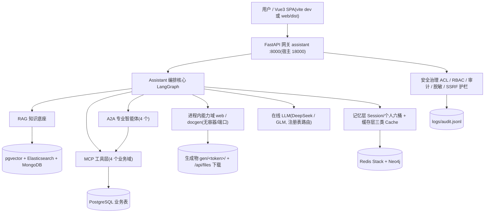
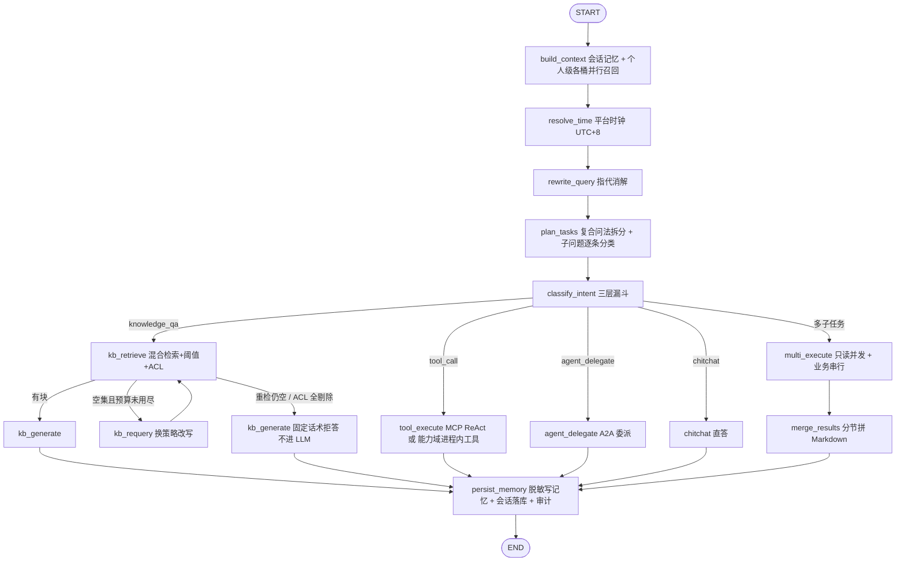

# 马小i 企业级多智能体 AI 助手系统 · 总体架构

<cite>
**参考文件**
- [README.md](file://README.md)
- [app/main.py](file://app/main.py)
- [app/config.py](file://app/config.py)
- [app/assistant/graph.py](file://app/assistant/graph.py)
- [app/assistant/intent.py](file://app/assistant/intent.py)
- [app/assistant/planner.py](file://app/assistant/planner.py)
- [app/memory/personal.py](file://app/memory/personal.py)
- [app/security/acl.py](file://app/security/acl.py)
- [app/db/models.py](file://app/db/models.py)
- [docker/docker-compose.yml](file://docker/docker-compose.yml)
</cite>

## 目录

1. [系统定位](#系统定位)
2. [分层架构](#分层架构)
3. [Assistant 编排核心](#assistant-编排核心)
4. [意图识别三层漏斗](#意图识别三层漏斗)
5. [多任务并行(复合问法拆分)](#多任务并行复合问法拆分)
6. [协议层：MCP 与 A2A](#协议层mcp-与-a2a)
7. [记忆层](#记忆层)
8. [缓存层与降级口径](#缓存层与降级口径)
9. [存储三层分工](#存储三层分工)
10. [安全与治理](#安全与治理)
11. [可观测性](#可观测性)
12. [服务拓扑与部署](#服务拓扑与部署)
13. [关键设计决策](#关键设计决策)

## 系统定位

参考马上消费"马小i"公开架构，实现 **Assistant-Agent 一入口多智能体** 模式：用户只面对唯一 Assistant 入口，由它按任务复杂度分层调度——知识库直答（RAG）、MCP 工具调用、A2A 专业智能体委派，外加一组**进程内工具能力域**（联网检索/抓取、文档生成）。全链路共享同一套记忆、权限、缓存与审计。

**Sources** · [README.md:1-55](file://README.md#L1-L55)

## 分层架构

模块边界：

| 层         | 目录                                                                        | 职责                                                                                          |
| ---------- | --------------------------------------------------------------------------- | --------------------------------------------------------------------------------------------- |
| 网关       | `app/main.py`                                                               | FastAPI 装配、SPA 托管（有 `web/dist` 才托管，否则提示走 vite dev）、lifespan 内建表/预热探测 |
| 调度核心   | `app/assistant/`                                                            | LangGraph 编排、三层意图漏斗、多任务拆分、会话记忆、MCP/A2A 客户端、SSE 流式与断点续流        |
| 记忆层     | `app/memory/`                                                               | 个人级六桶（画像/偏好/习惯/情节/知识/图谱）读写编排与自服务接口                               |
| 缓存层     | `app/cache/`                                                                | Prompt / Retrieval / Tool 三类缓存，统一落 Redis，全部可静默降级                              |
| RAG 底座   | `app/rag/` `app/docs/` `app/bodies/`                                        | 解析→归一化→父子切分→向量化→混合检索→重排→父块组装→ACL；正文外置 Mongo                        |
| 知识图谱   | `app/kg/`                                                                   | 文档级 GraphRAG（Neo4j `:KgDoc`/`:KgEntity`），抽取异步、ACL 只在查询出口生效                 |
| MCP 工具层 | `app/mcp_servers/`                                                          | HR 工单、财务报销、数据洞察、采购合同四个业务系统协议化                                       |
| A2A 智能体 | `app/agents/`                                                               | HR_Agent、Finance_Agent、Analyst_Agent、Contract_Agent                                        |
| 能力工具   | `app/tools/` `app/docgen/` `app/analytics/` `app/files/` `app/procurement/` | 联网检索/抓取、office/PDF/MD 生成、图表与报告、下载路由、确定性规则引擎                       |
| 存储层     | `app/db/`                                                                   | ORM 模型、异步/同步双引擎、只读 SQL 护栏                                                      |
| 安全治理   | `app/security/`                                                             | RBAC 白名单、文档 ACL、审计、脱敏、SSRF 护栏                                                  |

**Sources** · [README.md:180-258](file://README.md#L180-L258) · [app/main.py:174-225](file://app/main.py#L174-L225)

## Assistant 编排核心

`AssistantOrchestrator` 用 LangGraph `StateGraph` 把一次对话拆成可审计的节点链（拓扑以 `_build_graph` 为准）：

有强约束的设计点：

- **`resolve_time` 前置于意图识别**：问题命中相对时间词（`needs_current_time`）时在进程内取东八区时钟，注入后续各路由 Prompt，不依赖模型记忆日期。
- **`rewrite_query` 前置于意图识别与拆分**：分类器与全部分派路由共享消解后的独立问题，避免"那帮我查一下它的余额"误分类；首轮/无历史/自包含长问题（≥40 字且无指代标记）自动跳过，LLM 失败或输出不可信时回退原话。
- **Retrieve-Judge 循环**：`kb_retrieve → judge → generate / retry / refuse`。无结果时换 `RETRY_REWRITE_PROMPT` 重检一次（`retrieval_max_retries`），仍无结果或命中被 ACL 全量剔除时由 `kb_generate` 用固定话术拒答且**不进 LLM、不返回参考来源**；判定口径集中在 `_judge`，图条件边与并行分支共用。
- **出口第二道门禁**：`kb_retrieve` 在父块组装后同时跑 `is_allowed`（逐条最终授权）与 `docs_not_ready`（发布态），未就绪/无元数据的文档视同无权。
- **流式与断点续流**：`handle_stream` 把图执行放进后台任务，事件按自增 id 落 `StreamHub` 缓冲区；HTTP 连接只是读者，凭 `Last-Event-ID` 重连可先重放后续读（`app/assistant/stream.py`）。
- 身份与请求文本分离是贯穿全图的原则：工具调用经 System 消息下发操作者工号，A2A 经协议级 `metadata` 下发 `{user_id, role}`，并显式区分"当前操作者（登录态）"与"任务目标用户（消息指定）"，防止 LLM 把操作者工号误当查询参数。

**Sources** · [app/assistant/graph.py:1-59](file://app/assistant/graph.py#L1-L59) · [app/assistant/graph.py:1436-1491](file://app/assistant/graph.py#L1436-L1491) · [app/assistant/graph.py:587-708](file://app/assistant/graph.py#L587-L708)

## 意图识别三层漏斗

按"成本 / 确定性"排序的四段式漏斗，命中即短路，任一层返回 `None` 表示"不够确信，下沉一层"，结果带 `layer` 字段供审计：

| 层       | 实现                                                                                                  | 命中口径                                                                                                                           | 成本           |
| -------- | ----------------------------------------------------------------------------------------------------- | ---------------------------------------------------------------------------------------------------------------------------------- | -------------- |
| 1 规则   | `_RULES` 有序正则（委派类排在查询类前）+ `_detect_target`（单号优先于关键词，文件生成词优先于业务词） | 命中即 `confidence=0.9`                                                                                                            | 零网络调用     |
| 2 语义   | `_SEEDS` 内置种子按 `(intent, target)` 分组，bge-m3 向量 cosine                                       | 每组取 Top-`intent_semantic_top_k`(默认 3) 相似度均值，最优需 ≥ `intent_accept_threshold`(0.62) 且领先次优 ≥ `intent_margin`(0.05) | 一次 embedding |
| 3 LLM    | DeepSeek `INTENT_PROMPT`（`json_mode`，接入 Prompt Cache）                                            | 长难句/歧义表达兜底                                                                                                                | 一次 LLM       |
| fallback | `_AGENT_KEYWORDS` 启发式；`web`/`docgen` 能力域只能产 `tool_call`（无对应专业 Agent 可委派）          | 终端安全网，路由永不崩                                                                                                             | 零             |

第二层任何异常（Ollama 挂/维度不符）都只记 warning 后下沉，不阻断链路；`intent_embedding_enabled=false` 即整体跳过第二层。

**Sources** · [app/assistant/intent.py:1-21](file://app/assistant/intent.py#L1-L21) · [app/assistant/intent.py:96-144](file://app/assistant/intent.py#L96-L144) · [app/assistant/intent.py:229-250](file://app/assistant/intent.py#L229-L250) · [app/config.py:115-124](file://app/config.py#L115-L124)

## 多任务并行(复合问法拆分)

一句话问多件事（"查我年假还剩几天，明天北京天气咋样"）在单意图链路上必然丢一半。四处刻意设计：

- **拆分器只拆问题、不出意图**（`app/assistant/planner.py`）：意图口径的单一事实源留在三层漏斗，子问题逐条 `classify`，避免养出第二套会漂移的分类器；`_SPLIT_HINT` 做零网络调用的准入判定（太短/无并列标记一律不拆）。
- **扇出用节点内 `asyncio.gather` 而非 LangGraph `Send`**：KB 分支自带重检循环、tool 分支是 ReAct，分支体照样得写成 Python helper；`gather` 能在一处控住并发上限、单任务超时与部分失败隔离。
- **并行集默认拒**：只有 `knowledge_qa` 与 `target ∈ {web, docgen}` 的纯只读 `tool_call` 进并行集；业务域 `tool_call`（ReAct 自主选工具，分派前无法保证不调 `create_*`）与 `agent_delegate` 一律串行尾随。
- **合并不调 LLM 也不逐 token 流式**：各节内容已是事实，再过一次 LLM 只会引入改写与编造风险；两分支 token 流交错会糊在一段文本里，故整篇按任务顺序下发。

`MULTI_TASK_ENABLED=false` 即整体回退"一句一个意图一条路由"的旧行为；拆不完美的句子（有效子问题 < 2）也回退，拆分器永远不会成为对话链路的故障点。

**Sources** · [app/assistant/planner.py:1-16](file://app/assistant/planner.py#L1-L16) · [app/assistant/graph.py:397-453](file://app/assistant/graph.py#L397-L453) · [app/assistant/graph.py:1125-1157](file://app/assistant/graph.py#L1125-L1157) · [app/config.py:126-140](file://app/config.py#L126-L140)

## 协议层：MCP 与 A2A

**MCP（Model Context Protocol）** —— 业务系统协议化，四个域各一个 FastMCP 容器（`streamable-http`）：

| 域          | 容器/端口（宿主发布）                  | 代表工具                                                                                                                                               |
| ----------- | -------------------------------------- | ------------------------------------------------------------------------------------------------------------------------------------------------------ |
| hr          | `hr-mcp` `:8001/mcp`（18001）          | `create_hr_ticket` / `query_hr_ticket` / `list_hr_tickets` / `cancel_hr_ticket` / `get_leave_balance` / `execute_sql`                                  |
| finance     | `finance-mcp` `:8002/mcp`（18002）     | `create_reimbursement` / `query_reimbursement` / `list_reimbursements` / `finance_budget_query` / `get_reimbursement_policy` / `execute_sql`           |
| analytics   | `analytics-mcp` `:8005/mcp`（18005）   | `run_sql` / `describe_tables` / `get_metrics_snapshot` / `render_chart` / `write_weekly_report` / `list_artifacts`                                     |
| procurement | `procurement-mcp` `:8006/mcp`（18006） | `create_purchase_order` / `precheck_purchase_order` / `check_contract_clauses` / `submit_contract_review` / `save_contract_opinion` / `execute_sql` 等 |

- Client 端由 `langchain-mcp-adapters.MultiServerMCPClient` 发现工具并缓存（`MCPClientPool`），ReAct 循环注入前先过角色×工具白名单。
- 业务规则校验留在 Server 侧（报销单笔上限、类别枚举、单号规则、采购三条硬规则）。
- 另有一组**进程内能力域**（`app/tools/`）不属 MCP：`web`（`search_web`/`fetch_url`）与 `docgen`（`generate_*`），由 `tool_execute` 按 `CAPABILITY_TOOLS` 注册表直接注入，跳过 MCP 连接池与 MCP 权限矩阵；docgen 域额外并入只读检索工具，支撑"先调研后成文"。

**A2A（Agent2Agent）** —— 专业智能体委派：

- 每个 Agent 由 `agent_card.py`（能力/技能声明）、`executor.py`（`AgentExecutor` 桥接 LangGraph ReAct）、`server.py`（`A2AStarletteApplication`）三件套组成：`hr-agent :9001`、`finance-agent :9002`、`analyst-agent :9005`、`contract-agent :9006`。
- Agent Card 发布于 `/.well-known/agent-card.json`，通信为 JSON-RPC 2.0 over HTTP 的 `message/send`。
- **卡片通告地址不作路由依据**：`_pin_card_url` 强制把 `card.url` 换成配置端点，否则宿主直连时会被容器内服务名（`http://hr-agent:9001`）带进静默失败的下一步。
- 可信身份只取 `Message.metadata`，不从文本解析角色。

Text2SQL：`execute_sql`/`run_sql` 受 `app/db/sql_guard.py` 硬约束（单条 SELECT、PostgreSQL 关键字黑名单含 `SELECT INTO`/`COPY`/`pg_sleep`/`lo_export`、业务表白名单、强制 `LIMIT 50`），执行前由 `app/db/sync.py` 注入 `SET LOCAL statement_timeout`；跨域基础能力 `lookup_employee_by_name`（姓名→工号，同名返回 `needs_selection` 候选）由 `app/agents/common_tools.py` 统一注入入口与各专业 Agent。

**Sources** · [app/security/auth.py:10-122](file://app/security/auth.py#L10-L122) · [app/tools/**init**.py:1-45](file://app/tools/__init__.py#L1-L45) · [app/assistant/a2a_client.py:31-54](file://app/assistant/a2a_client.py#L31-L54) · [app/db/sql_guard.py:1-36](file://app/db/sql_guard.py#L1-L36)

## 记忆层

三层记忆各有独立存储与降级路径（Project Memory 尚未实现）：

| 层             | 载体                                                                                 | 降级                                                |
| -------------- | ------------------------------------------------------------------------------------ | --------------------------------------------------- |
| Session Memory | Redis 滚动窗口 + 溢出 LLM 摘要（`app/assistant/memory.py`）                          | 进程内 dict（多 worker 一致性变弱，属降级固有代价） |
| Working State  | LangGraph `AsyncRedisSaver` checkpointer（需 Redis Stack 的 RedisJSON + RediSearch） | `InMemorySaver`                                     |
| 个人级记忆六桶 | `PersonalMemoryAgent` 编排（`app/memory/personal.py`）                               | 逐桶各自缺席                                        |

六桶 = 画像 / 偏好 / 习惯 / 情节 / 知识 / 图谱。落库分布是：画像单独一张 `user_profiles`（一人一条、确定性合并，不检索、每轮全量带）；偏好/习惯/情节/知识共用 `long_term_memories`，以 `kind` 列作桶判别；图谱在 Neo4j（`(:MemoryUser)-[:MENTIONS]->(:MemoryEntity)`）。桶语义（`kind`/注入方式/中文标签/prompt 小节标题）的单一事实源在 `app/memory/taxonomy.py`。

- **读路径**：`build()` 用 `asyncio.gather` 并行拉画像、偏好/习惯标量直读、情节+知识+遗留 fact 的一次向量召回、Neo4j 关联事实；命中条目 `_touch` 刷新 `last_accessed_at`。
- **写路径**：`persist_memory` 一次 LLM 提取产出全部桶（`app/memory/extraction.py`），分桶落盘；会话窗口溢出折叠出的摘要另存一条情节。闲聊轮不再按路由一刀切跳过提取（"我在研发部"恰恰会被判成 chitchat），只保留短消息过滤。
- **新鲜度与蒸馏**：情节按 `episodic_window_days` 时间窗过滤并按 `memory_decay_days` 降权；新增情节达 `memory_reflect_min_episodes` 才调一次 LLM 把情节蒸馏为个人知识。
- 总开关：`long_term_memory_enabled`（长期记忆通道）与 `personal_memory_enabled`（关闭则退回单一 fact 老通道）。

**Sources** · [app/memory/personal.py:1-20](file://app/memory/personal.py#L1-L20) · [app/memory/taxonomy.py:1-100](file://app/memory/taxonomy.py#L1-L100) · [app/assistant/graph.py:311-348](file://app/assistant/graph.py#L311-L348) · [app/assistant/graph.py:1084-1121](file://app/assistant/graph.py#L1084-L1121)

## 缓存层与降级口径

三类缓存统一落 Redis（`app/cache/`），Redis 关闭/连不上就退回直连真实调用，不报错不阻断：

| 缓存            | key 组成                                         | 默认 TTL           | 接入门槛（默认拒）                                                                                                                 |
| --------------- | ------------------------------------------------ | ------------------ | ---------------------------------------------------------------------------------------------------------------------------------- |
| Prompt Cache    | `model\|temperature\|sha256(prompt)`             | 300s               | 只给"同 prompt → 同结果"的纯函数式调用；严禁用于知识库生成（输出携带 ACL 与实时检索结果）                                          |
| Retrieval Cache | `query\|top_k\|top_n\|ACL签名(user\|dept\|role)` | 300s               | key 必须带身份签名；文档重入库时 `refresh_knowledge()` 调 `invalidate_all()`（SCAN 而非 KEYS）                                     |
| Tool Cache      | `server\|tool\|args(sort_keys)\|role`            | 30s（web 域 300s） | 工具名需命中只读前缀 `query_/list_/get_/check_/lookup_/search_`；`generate_*`/`create_*`/`submit_*` 天然不命中；A2A 委派整体不接入 |

两个刻意保留的"不优化"：流式闲聊不读 Prompt Cache（命中的重放没有思考过程）；多任务合并不再过 LLM。

**Sources** · [app/cache/prompt_cache.py:1-7](file://app/cache/prompt_cache.py#L1-L7) · [app/cache/retrieval_cache.py:1-16](file://app/cache/retrieval_cache.py#L1-L16) · [app/cache/tool_cache.py:1-18](file://app/cache/tool_cache.py#L1-L18)

## 存储三层分工

不是"单一 PostgreSQL"，也不是"Mongo 已下线"：

- **PostgreSQL + pgvector（事实来源）**：`documents`/`tags`/`document_tags`（ACL 真相在 `documents`）、`doc_parents`（父块结构，不存正文）、`doc_chunks`（子块 + `chunk_text` + 向量 + ACL 标量列，HNSW `vector_cosine_ops` `m=16/ef_construction=64`）、业务表 `hr_*`/`fin_*`/`proc_*`、`long_term_memories`、`user_profiles`、`chat_sessions`/`chat_messages`、`report_artifacts`；旧单表 `knowledge_chunks` 仅供迁移脚本读写。
- **MongoDB（正文外置层）**：`doc_bodies`（整篇 `raw_text`/`normalized_text`/`structure`，超 15MB 溢出 `doc_body_parts`）与 `parent_texts`（父块全文）；只按 `_id/parent_id` 精确批量取，无全文查询、不承载权限语义。关闭 Mongo 时父块上下文退回子块文本（不阻断对话），入库写正文则直接报错。
- **Elasticsearch（派生倒排）**：BM25 稀疏通道，只存 `content_tokens`（jieba 预分词空格拼接，无需 IK 插件），可从 PG 全量重建。
- **Redis**：Session Memory + Working State checkpoint + 三类缓存，必须是 redis-stack-server。
- **Neo4j**：个人图谱（`:MemoryUser`/`:MemoryEntity`）与文档知识图谱（`:KgDoc`/`:KgEntity`/`:KG_REL`）两套标签命名空间共用一个驱动单例。

连接双通道：异步 `asyncpg`（`app/db/session.py`，供网关与 RAG）与同步 `psycopg3`（`app/db/sync.py`，供 FastMCP 工具），共用同一份 `Settings`。

**Sources** · [README.md:29-32](file://README.md#L29-L32) · [app/db/models.py:275-472](file://app/db/models.py#L275-L472) · [app/bodies/store.py:1-9](file://app/bodies/store.py#L1-L9) · [app/config.py:171-213](file://app/config.py#L171-L213)

## 安全与治理

- **RBAC 白名单**：`app/security/auth.py` 维护"角色×域"与"角色×工具"两层矩阵，默认拒绝——未列入白名单的工具对该角色 LLM **完全隐藏**（看不见也调不到）；`execute_sql`/`run_sql` 可跨全员取数，属敏感工具，仅管理角色可见，普通员工在 analytics 域无任何工具。
- **文档级 ACL**：`public / dept / role / private` 四种可见性，`Principal(user_id, department, role)` 在两条检索通道各自前置裁剪，父块组装后再逐条复核（纵深防御），管理员全量可见、未知可见性 default-deny。
- **发布态门禁**：`status != ready` 或无元数据行的文档在检索出口视同无权，防"入库中的半篇文档"被答出去。
- **全链路审计**：Append-only JSONL，同一 `trace_id` 串联 `message_received → time_resolved → query_rewritten → intent_classified → kb_retrieved / tools_filtered / mcp_dispatch / acl_final_check_dropped / mcp_permission_denied → turn_completed`，写入前统一脱敏。
- **脱敏**：身份证、银行卡、手机号正则掩码；`salary/薪酬/工资/amount` 字段值替换为 `***`；URL/下载链接段原样保留（否则打码会把链接撕成坏链）。
- **SSRF 护栏**（`app/security/url_guard.py`，全仓唯一实现）：字面名拒（localhost / `host.docker.internal` / 全部 compose 服务名）→ 可选域名白名单 default-deny → DNS 解析结果逐条 `is_global` 校验；拒绝带 userinfo 的 URL；抓取侧手动逐跳跟随重定向且每跳重过护栏、落地后复核 final URL，把 TOCTOU/DNS-rebinding 窗口压到单跳内。
- **越权存在性不泄露**：ACL 全量剔除与普通"无结果"复用同一句拒答话术。

**Sources** · [app/security/auth.py:10-165](file://app/security/auth.py#L10-L165) · [app/security/acl.py:1-85](file://app/security/acl.py#L1-L85) · [app/security/masking.py:8-42](file://app/security/masking.py#L8-L42) · [app/security/url_guard.py:1-18](file://app/security/url_guard.py#L1-L18)

## 可观测性

- **`audit.jsonl`**：面向合规留痕，每节点一条，敏感字段脱敏。
- **LangSmith**：面向开发调试/评估，只出本机；容器侧由 compose 字面量锁死 `LANGSMITH_TRACING=false`。
- **Langfuse 自托管**：与 LangSmith 并存的独立开关，跑在同一 compose 网络（`profile=langfuse` 的 6 个容器），对话数据不出本机，容器侧也可开启。接入点是 `app/tracing.py::langfuse_callback()`，挂在图顶层 `ainvoke` 的 config 上，回调沿 LangGraph 传播到所有子 run，一轮对话归并为**一条 trace**；trace id 由审计的 `trace_id` 经 `Langfuse.create_trace_id(seed=...)` 确定性派生，可双向跳转。未启用/未配密钥/缺包时返回空 dict，`**` 展开即无操作。
- 启动自检：`_log_dependency_endpoints()` 打印各依赖的真实对接地址（只打地址不打密钥），因为降级是静默的，只看页面表现无法区分"功能坏了"与"配置指到了另一轨地址"。

**Sources** · [README.md:467-518](file://README.md#L467-L518) · [app/tracing.py:1-60](file://app/tracing.py#L1-L60) · [app/main.py:53-87](file://app/main.py#L53-L87)

## 服务拓扑与部署

| 服务                                                      | 容器内监听                | 宿主发布                      | 说明                                                                                  |
| --------------------------------------------------------- | ------------------------- | ----------------------------- | ------------------------------------------------------------------------------------- |
| assistant                                                 | 8000                      | 18000                         | FastAPI 网关 + SPA + `/api/chat`、`/api/docs`、`/api/memory`、`/api/kg`、`/api/files` |
| hr-mcp / finance-mcp / analytics-mcp / procurement-mcp    | 8001 / 8002 / 8005 / 8006 | 18001 / 18002 / 18005 / 18006 | FastMCP streamable-http                                                               |
| hr-agent / finance-agent / analyst-agent / contract-agent | 9001 / 9002 / 9005 / 9006 | 同左                          | A2A Starlette                                                                         |
| postgres                                                  | 5432                      | 5432                          | pgvector/pg16 镜像，`docker/init/01_vector.sql` 首启装扩展                            |
| elasticsearch / redis / mongo                             | 9200 / 6379 / 27017       | 同左                          | 单节点内网无认证（对齐部署取舍）                                                      |
| neo4j                                                     | 7474 / 7687               | 17474 / 17687                 | HTTP 控制台仅人工看图谱时用；bolt 是功能必需                                          |
| tei-rerank                                                | 8080                      | 8080（`TEI_PORT`）            | 真 cross-encoder `/rerank` + `/health`                                                |
| mineru                                                    | 8888                      | 8888                          | 图片/扫描件 OCR                                                                       |
| Ollama                                                    | 11434                     | 宿主机                        | 唯一非 docker 依赖，只跑 bge-m3 embedding                                             |
| langfuse-\*                                               | —                         | 18100 等                      | `profile=langfuse`，与业务存储完全隔离                                                |

- 宿主端口抬到 `18xxx`/`17xxx` 是因为 Windows `winnat`/Hyper-V 每次开机会把整段端口写进 TCP 排除范围，段内端口即使无人监听也无法 bind；抬端口只动宿主发布端口，容器内监听与 compose 网络内服务名地址一律不变。
- 敏感信息经 compose secrets 挂到 `/run/secrets/*`，由 `Settings` 的 `field_validator` 回退读取（其次 `docker/secrets/<name>.txt`），不进镜像、不进 dotenv、不进 git。
- **容器是唯一验证环境**：网关必须跑在 compose 内，宿主禁止直跑 `uvicorn app.main:app` 做代码验证；改过 `app/` 任何代码都要 `-Build` 重建镜像。配置分宿主轨（`.env`，指向已发布端口，仅供宿主侧脚本）与容器轨（`docker/.env` + compose `environment` 注入服务名地址），红线键在 compose 里字面量锁死，自检 `scripts.dev_services env-check`。

**Sources** · [README.md:316-420](file://README.md#L316-L420) · [docker/docker-compose.yml:25-45](file://docker/docker-compose.yml#L25-L45) · [app/config.py:61-83](file://app/config.py#L61-L83)

## 关键设计决策

| 决策                                         | 取舍理由                                                                                                                |
| -------------------------------------------- | ----------------------------------------------------------------------------------------------------------------------- |
| 一入口分层调度                               | 用户无需选择"哪个 Agent/工具"，复杂度由意图识别承担；三条链路共用一套记忆、权限与审计                                   |
| 意图走三层漏斗而非直接问 LLM                 | 高频固定指令 0ms 规则命中、标准问法一次 embedding 命中，只有长难句下沉 LLM；每层可单独关停且逐层降级                    |
| 拆分器只拆问题不出意图                       | 意图口径必须只有一个事实源，否则两处分类器必然漂移                                                                      |
| 改写前置于分类                               | 分类器和全部路由共享同一消解结果，避免指代未解导致的误路由与错检索                                                      |
| MySQL+Milvus → PostgreSQL 统一元数据与向量层 | 元数据/业务表/向量同库同事务，消除跨库同步；ACL 变更由"读回整行含向量再 upsert"降为一条 `UPDATE`                        |
| 正文外置 MongoDB                             | PG 只留可索引窄行，ANN 扫描不拖宽行；正文按 `_id` 精确取，不做全文查询                                                  |
| ES 独立部署但只做派生索引                    | BM25 依赖语料级 df/avgdl 与 Lucene 段文件管理，必须常驻进程；派生态可全量重建，故不承载事实                             |
| 单一相关性阈值只作用于 rerank                | 各通道分数尺度不可比（余弦距离 / BM25 / RRF / rerank），阈值散在各处必然失准                                            |
| rerank 用独立 TEI 容器而非 Ollama            | 借道 `/api/embed` 的伪 rerank 既非 cross-encoder，该 GGUF 在 Windows llama.cpp 上还会调用即崩                           |
| Tool Cache 只缓存只读前缀、A2A 整体不缓存    | 把"提交成功"复用给下一次提交会造成业务数据不一致；无法确认是只读就不缓存                                                |
| 拒答不进 LLM                                 | 无相关资料时用固定话术，宁可不答也不生成幻觉                                                                            |
| 权限走协议级 metadata + 卡片地址不作路由依据 | 用户文本里的角色字样一律不信，缺失即按 `employee` 最小权限；端点以配置为准，防被外部卡片引到非预期主机                  |
| 全链路"能降级就降级"                         | Redis/Neo4j/TEI/Mongo/ES 任一不可用都只让对应通道缺席，代价是必须用启动日志与 `dev_services check` 定位，而非看页面表现 |

**Sources** · [app/rag/vectorstore.py:1-16](file://app/rag/vectorstore.py#L1-L16) · [app/rag/reranker.py:1-10](file://app/rag/reranker.py#L1-L10) · [app/cache/tool_cache.py:1-18](file://app/cache/tool_cache.py#L1-L18) · [app/config.py:142-166](file://app/config.py#L142-L166)
