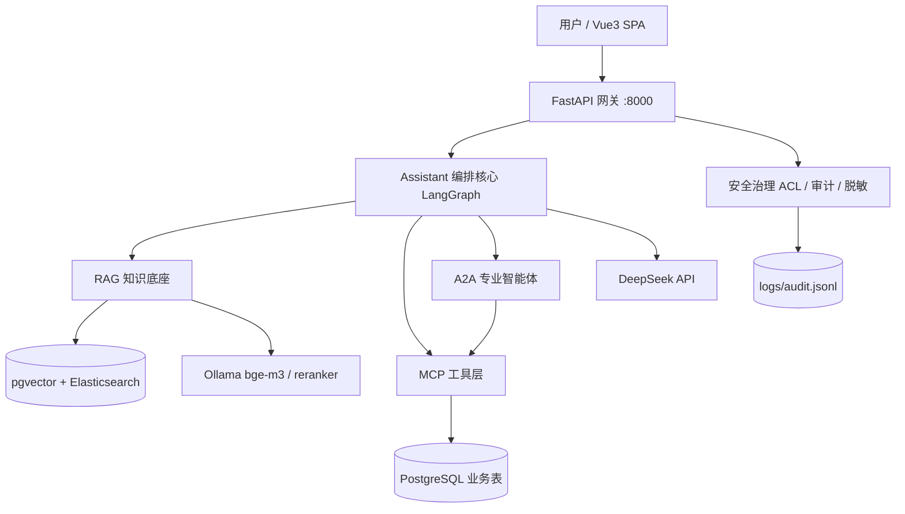
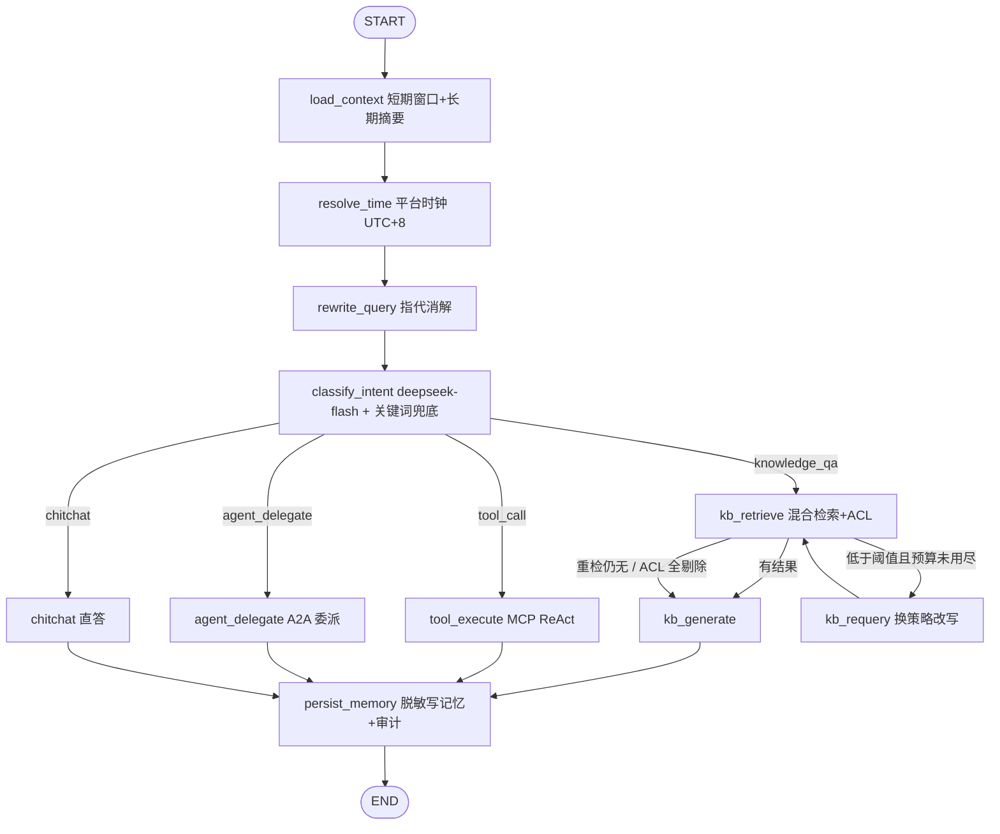

# 马小i 企业级多智能体 AI 助手系统 · 总体架构

<cite>
**参考文件**
- [README.md](file://README.md)
- [app/main.py](file://app/main.py)
- [app/config.py](file://app/config.py)
- [app/assistant/graph.py](file://app/assistant/graph.py)
- [app/security/acl.py](file://app/security/acl.py)
- [app/db/models.py](file://app/db/models.py)
- [docker/docker-compose.yml](file://docker/docker-compose.yml)
- [maxiaoi .txt](file://maxiaoi%20.txt)（原始架构需求蓝图）
</cite>

## 目录
1. [系统定位](#系统定位)
2. [分层架构](#分层架构)
3. [Assistant 编排核心](#assistant-编排核心)
4. [协议层：MCP 与 A2A](#协议层mcp-与-a2a)
5. [统一存储层](#统一存储层)
6. [安全与治理](#安全与治理)
7. [服务拓扑与部署](#服务拓扑与部署)
8. [关键设计决策](#关键设计决策)

## 系统定位

参考马上消费"马小i"公开架构，实现 **Assistant-Agent 一入口多智能体** 模式：用户只面对唯一 Assistant 入口，由它按任务复杂度分层调度到三条能力链路——知识库直答（RAG）、MCP 工具调用、A2A 专业智能体委派。需求蓝图见 `maxiaoi .txt`。

**Sources** · [README.md:1-36](file://README.md#L1-L36) · [maxiaoi .txt:1-37](file://maxiaoi%20.txt#L1-L37)

## 分层架构

模块边界：

| 层 | 目录 | 职责 |
|---|---|---|
| 网关 | `app/main.py` | FastAPI 装配、SPA 静态托管、启动建表 |
| 调度核心 | `app/assistant/` | LangGraph 编排、意图识别、记忆、MCP/A2A 客户端 |
| RAG 底座 | `app/rag/` `app/docs/` | 解析→切分→向量化→混合检索→重排→ACL |
| MCP 工具层 | `app/mcp_servers/` | HR 工单、财务报销业务系统协议化 |
| A2A 智能体 | `app/agents/` | HR_Agent、Finance_Agent 专业委派 |
| 存储层 | `app/db/` | ORM 模型、异步/同步双引擎、SQL 护栏 |
| 安全治理 | `app/security/` | RBAC 白名单、文档 ACL、审计、脱敏 |

**Sources** · [README.md:116-161](file://README.md#L116-L161) · [app/main.py:52-77](file://app/main.py#L52-L77)

## Assistant 编排核心

`AssistantOrchestrator` 用 LangGraph `StateGraph` 把一次对话拆成可审计的节点链：

三个顺序有强约束的设计点：

- **`resolve_time` 前置于意图识别**：问题命中相对时间词（`needs_current_time`）时在进程内取东八区时钟，注入后续四类路由 Prompt，不依赖模型记忆日期。
- **`rewrite_query` 前置于意图识别**：分类器与全部四条路由共享消解后的独立问题，避免"那帮我查一下它的余额"误分类；首轮/无历史/自包含长问题（≥40 字且无指代标记）自动跳过，LLM 失败或输出不可信时回退原话。
- **Retrieve-Judge 循环**：`kb_retrieve → judge → generate / retry / refuse`。无结果时换 `RETRY_REWRITE_PROMPT` 重检一次（`retrieval_max_retries`），仍无结果或命中被 ACL 全量剔除时，由 `kb_generate` 用固定话术拒答且**不进 LLM、不返回参考来源**，从根上杜绝"噪声变小说"。

身份与请求文本分离是贯穿全图的原则：工具调用经 System 消息下发操作者工号，A2A 经协议级 `metadata` 下发 `{user_id, role}`，并显式区分"当前操作者（登录态）"与"任务目标用户（消息指定）"，防止 LLM 把操作者工号误当查询参数。

**Sources** · [app/assistant/graph.py:1-28](file://app/assistant/graph.py#L1-L28) · [app/assistant/graph.py:139-604](file://app/assistant/graph.py#L139-L604) · [app/assistant/intent.py:36-71](file://app/assistant/intent.py#L36-L71) · [app/assistant/memory.py:24-60](file://app/assistant/memory.py#L24-L60)

## 协议层：MCP 与 A2A

**MCP（Model Context Protocol）** —— 业务系统协议化：

- Server 端用官方 MCP Python SDK 的 FastMCP 高层 API，`streamable-http` transport：HR `:8001/mcp`、财务 `:8002/mcp`。
- HR 域工具：`create_hr_ticket` / `query_hr_ticket` / `list_hr_tickets` / `cancel_hr_ticket` / `get_leave_balance` / `execute_sql`。
- 财务域工具：`create_reimbursement` / `query_reimbursement` / `list_reimbursements` / `finance_budget_query` / `get_reimbursement_policy` / `execute_sql`。
- Client 端由 `langchain-mcp-adapters.MultiServerMCPClient` 发现工具并缓存，ReAct 循环按角色白名单过滤后注入。
- 业务规则校验留在 Server 侧（如单笔报销 ≤5000 元、类别枚举、单号 `FIN5000+` 生成）。

**A2A（Agent2Agent）** —— 专业智能体委派：

- 每个 Agent 由 `agent_card.py`（能力/技能声明）、`executor.py`（`AgentExecutor` 桥接 LangGraph ReAct）、`server.py`（`A2AStarletteApplication`）三件套组成。
- Agent Card 发布于 `/.well-known/agent-card.json`，通信为 JSON-RPC 2.0 over HTTP 的 `message/send`。
- Client 侧 `A2AClientPool` 先拉卡再发信，结果从 `Task.status.message` / `artifacts` / `Message` 中抽取文本。

Text2SQL：`execute_sql` 是灵活统计查询通道，受 `app/db/sql_guard.py` 硬约束（单条 SELECT、PostgreSQL 关键字黑名单、业务表白名单、强制 `LIMIT 50`），执行前由 `app/db/sync.py` 注入 `SET LOCAL statement_timeout`；跨域基础能力 `lookup_employee_by_name`（姓名→工号，同名返回 `needs_selection` 候选）由 `app/agents/common_tools.py` 统一注入入口与各专业 Agent。

**Sources** · [app/mcp_servers/hr_server.py:26-163](file://app/mcp_servers/hr_server.py#L26-L163) · [app/mcp_servers/finance_server.py:26-208](file://app/mcp_servers/finance_server.py#L26-L208) · [app/agents/finance_agent/executor.py:106-190](file://app/agents/finance_agent/executor.py#L106-L190) · [app/agents/finance_agent/server.py:20-36](file://app/agents/finance_agent/server.py#L20-L36) · [app/db/sql_guard.py:45-73](file://app/db/sql_guard.py#L45-L73)

## 统一存储层

全部持久化统一到一个 PostgreSQL 实例（原 MySQL 元数据 + Milvus Lite 向量库组合已下线，`scripts/migrate_mxi_storage.py` 为一次性搬迁脚本）：

- `documents` / `tags` / `document_tags`：文档与标签元数据，`documents` 是 ACL 的事实来源。
- `hr_employees` / `hr_tickets` / `hr_leave_records` / `fin_reimbursements` / `fin_department_budgets`：Text2SQL 业务表。
- `knowledge_chunks`：pgvector 知识块表，HNSW + `vector_cosine_ops`（`m=16, ef_construction=64`），单表同时承担稠密 ANN、父子块组装、ACL 标量裁剪。
- Elasticsearch 保留为**独立服务**，只是可从 PostgreSQL 全量重建的 BM25 派生索引（`rebuild_bm25` 在网关首启与每次入库/权限变更后重刷）。

连接双通道：异步 `asyncpg`（`app/db/session.py`，供网关与 RAG）与同步 `psycopg3`（`app/db/sync.py`，供 FastMCP 工具），共用同一份 `Settings`。

**Sources** · [app/db/models.py:36-221](file://app/db/models.py#L36-L221) · [app/db/sync.py:45-97](file://app/db/sync.py#L45-L97) · [README.md:29-31](file://README.md#L29-L31)

## 安全与治理

- **RBAC 白名单**：`app/security/auth.py` 维护角色×工具矩阵，默认拒绝——未列入白名单的工具对该角色 LLM **完全隐藏**（看不见也调不到），而非调用时报错；`execute_sql`、`finance_budget_query` 等敏感工具只对管理角色开放。
- **文档级 ACL**：`public / dept / role / private` 四种可见性，`Principal(user_id, department, role)` 在检索前做 Metadata Filter 前置裁剪，父块组装后再逐条复核（纵深防御），管理员全量可见、未知可见性 default-deny。
- **全链路审计**：Append-only JSONL，同一 `trace_id` 串联 `message_received → time_resolved → query_rewritten → intent_classified → tools_filtered/kb_retrieved → turn_completed`，写入前统一 `mask_sensitive`。
- **脱敏**：身份证、银行卡、手机号正则掩码；`salary/薪酬/工资/amount` 字段值替换为 `***`。
- **越权存在性不泄露**：ACL 全量剔除与普通"无结果"复用同一句拒答话术。

**Sources** · [app/security/auth.py:10-117](file://app/security/auth.py#L10-L117) · [app/security/acl.py:30-85](file://app/security/acl.py#L30-L85) · [app/security/audit.py:28-65](file://app/security/audit.py#L28-L65) · [app/security/masking.py:20-41](file://app/security/masking.py#L20-L41)

## 服务拓扑与部署

| 服务 | 端口 | 说明 |
|---|---|---|
| assistant | 8000 | FastAPI 网关 + SPA + `/api/chat`、`/api/docs` |
| hr-mcp / finance-mcp | 8001 / 8002 | FastMCP streamable-http |
| hr-agent / finance-agent | 9001 / 9002 | A2A Starlette |
| postgres | 5432 | pgvector/pg16 镜像，`docker/init/01_vector.sql` 首启装扩展 |
| elasticsearch | 9200 | 单节点 BM25 索引 |
| mineru | 8888 | 图片 OCR，`--profile mineru` 按需启动 |
| Ollama | 11434 | 宿主机推理服务（bge-m3 / bge-reranker-v2-m3） |

敏感信息经 compose secrets 挂载到 `/run/secrets/*`，由 `Settings` 的 `field_validator` 回退读取，不进镜像、不进环境变量、不进 git。开发期 `langgraph dev` + LangSmith 仅本地启用（生产 `LANGSMITH_TRACING=false`）。配置红线见 `CONFIG_RULES.md`（容器内 `OLLAMA_BASE_URL` 必须 `host.docker.internal`、`PG_HOST` 必须服务名 `postgres`）。

**Sources** · [docker/docker-compose.yml:19-203](file://docker/docker-compose.yml#L19-L203) · [app/config.py:9-129](file://app/config.py#L9-L129) · [CONFIG_RULES.md:1-29](file://CONFIG_RULES.md#L1-L29)

## 关键设计决策

| 决策 | 取舍理由 |
|---|---|
| 一入口分层调度 | 用户无需选择"哪个 Agent/工具"，复杂度由意图识别承担；三条链路共用一套记忆、权限与审计 |
| 改写前置于分类 | 分类器和四条路由共享同一消解结果，避免指代未解导致的误路由与错检索 |
| MySQL+Milvus → 单 PostgreSQL | 元数据/业务表/向量同库同事务，消除跨库同步；ACL 变更由"读回整行含向量再 upsert"降为一条 `UPDATE` |
| ES 独立部署但只做派生索引 | BM25 依赖语料级 df/avgdl 与 Lucene 段文件管理，必须常驻进程；派生态可全量重建，故不承载事实 |
| 单一相关性阈值只作用于 rerank | 各通道分数尺度不可比（余弦距离 / BM25 / RRF / rerank），阈值散在各处必然失准 |
| 权限走协议级 metadata | 用户文本里的角色字样一律不信，缺失即按 `employee` 最小权限，防伪造 |
| 拒答不进 LLM | 无相关资料时用固定话术，宁可不答也不生成幻觉 |

**Sources** · [app/rag/vectorstore.py:1-10](file://app/rag/vectorstore.py#L1-L10) · [app/config.py:44-82](file://app/config.py#L44-L82)
